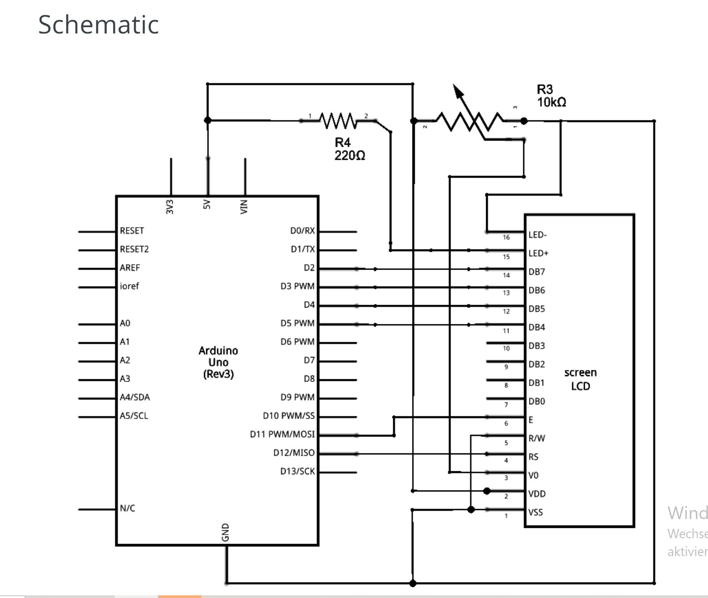
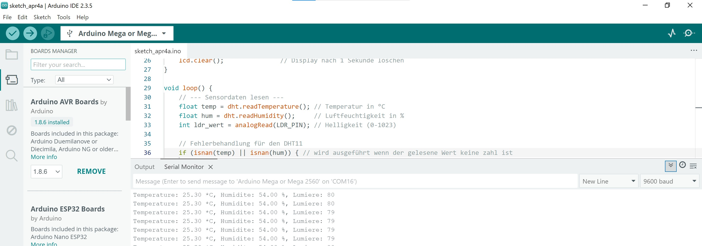
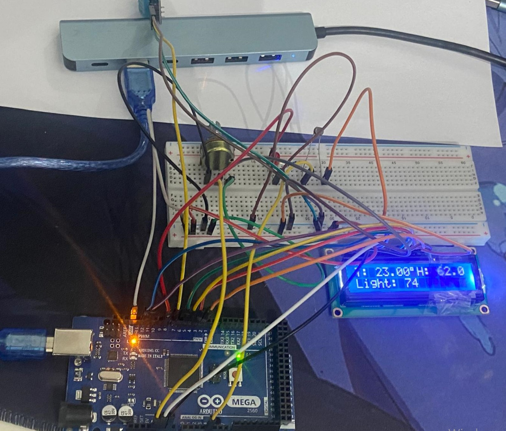
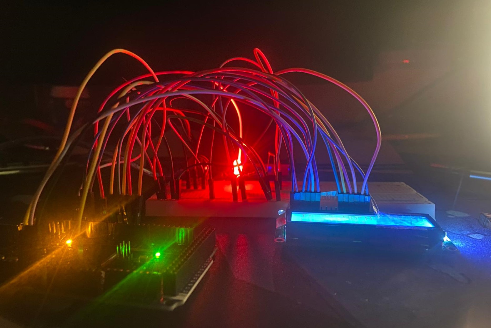

# 🌦️ Mini Wetterstation (Arduino)

Ein einfaches Arduino-basiertes Mini-Wetterstations-Projekt, das folgende Größen misst:

- 🌡️ **Temperatur (°C)**
- 💧 **Luftfeuchtigkeit (%)**
- 💡 **Lichtintensität (LDR-Wert)**

Die Werte werden auf einem **16×2 LCD** angezeigt.  
Zusätzlich schaltet sich eine **LED** automatisch ein, wenn der Lichtwert unter einen definierten Grenzwert fällt – ähnlich wie Straßenlampen, die nachts angehen.

---

## 🔧 Hardware-Komponenten
- Arduino Mega 2560 (oder kompatibles Board)  
- DHT11-Sensor (Temperatur & Luftfeuchtigkeit)  
- LDR (Lichtabhängiger Widerstand)  
- 10 kΩ Widerstand (für LDR-Spannungsteiler)  
- 10 kΩ Potentiometer (für LCD-Kontrast)  
- 16×2 LCD (Parallel-Interface)  
- 1× LED (Statusanzeige)  
- Breadboard + Jumperkabel  

---

## ⚡ Schaltplan (Übersicht)

### DHT11
VCC → 5V
GND → GND
DATA → D7

### LDR
Eine Seite → 5V
Andere Seite → A4 + 10 kΩ Widerstand → GND

### LCD (16x2):
Pin 1 (VSS)   → GND  
Pin 2 (VCC)   → 5V  
Pin 3 (V0)    → Mittlerer Pin des Potentiometers (Kontrast)  
Pin 4 (RS)    → D12  
Pin 5 (RW)    → GND  
Pin 6 (E)     → D11  
Pin 11 (D4)   → D5  
Pin 12 (D5)   → D4  
Pin 13 (D6)   → D3  
Pin 14 (D7)   → D2  
Pin 15 (LED+) → 5V (über 220Ω)  
Pin 16 (LED-) → GND  

### LED-Indikator
Anode (+) → D8
Kathode (–) → GND

---

## 🖥️ Software

- **Arduino IDE**  
- Notwendige Libraries:  
  - [DHT-Sensor-Library](https://github.com/adafruit/DHT-sensor-library)  
  - [Adafruit Unified Sensor](https://github.com/adafruit/Adafruit_Sensor)  
  - Eingebaute **LiquidCrystal**-Bibliothek  

-> Installation der Libraries über den Arduino Library Manager.  

---

## 🚀 Verwendung

1. Repository klonen oder herunterladen  
2. Sketch in der Arduino IDE öffnen  
3. Auf den Arduino hochladen (Mega oder Uno, ggf. Pins anpassen)  
4. **Serial Monitor** öffnen (9600 Baud), um Live-Werte zu sehen  
5. LCD zeigt Temperatur, Luftfeuchtigkeit und Lichtstärke an  
6. LED schaltet sich ein, wenn der Lichtwert unter dem Grenzwert (`limit = 30`) liegt  

---

## 🔎 Funktionsweise des Codes

- **Initialisierung**  
  - DHT11 und LCD werden gestartet  
  - LED-Pin als Ausgang definiert  
  - LCD zeigt beim Start *„mini wetter station“*  

- **Sensorwerte erfassen**  
  - Temperatur → `dht.readTemperature()`  
  - Luftfeuchtigkeit → `dht.readHumidity()`  
  - Lichtintensität → `analogRead(A4)`  
  - Ungültige Werte (NaN) → Fehlermeldung im Serial Monitor  

- **Anzeige auf LCD**  
  - Zeile 1 → Temperatur + Luftfeuchtigkeit  
  - Zeile 2 → Lichtwert  

- **Serielle Ausgabe**  
  - Alle Werte zusätzlich im Serial Monitor  

- **LED-Steuerung**  
  - `LDR < limit` → LED **AN**  
  - sonst → LED **AUS**  

- **Zyklus**  
  - Neue Messungen alle **2 Sekunden**  

---

## 📸 Demo

  
  
  
  

---

## ⚙️ Zukünftige Erweiterungen
- 📂 Datenspeicherung mit **SD-Kartenmodul**  
- ⏰ Echtzeituhr (**RTC**) für Zeitstempel  
- 🌡️ Upgrade auf **DHT22** (höhere Genauigkeit)  
- 📡 ESP32 + **WLAN-Dashboard**  

---

## 👤 Autor
Entwickelt von **Dimitry Ntofeu Nyatcha**
